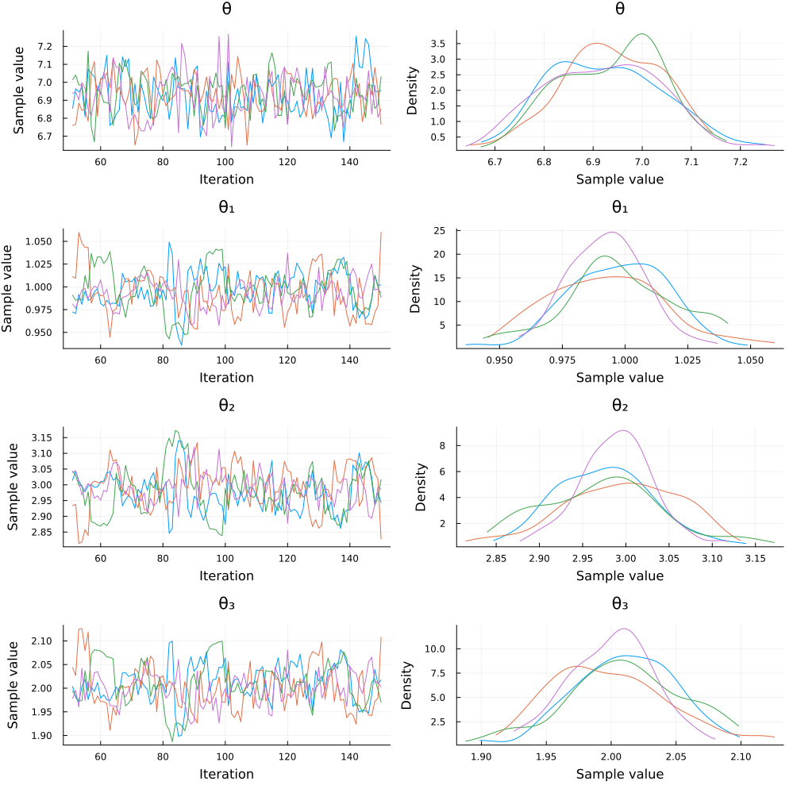

# Bayesian inference with `Turing.jl`


The compatibility with `Distributions.jl`'s API allows a lot of interactions with the broader ecosystem. One of the firsts examples that we discovered was the possibility to do Bayesian inference of model parameters (copula included) with [`Turing.jl`](https://turing.ml/). 

Consider that we have a given model with a certain copula and certain marginals, all having parameters to be fitted. Then we can use Turing's `@addlogprob!` to compute the loglikelihood of our model and maximize it around the parameters alongside the chain as follows: 

```julia
using Copulas
using Distributions
using Random
using Turing
using StatsPlots

Random.seed!(123)
true_θ = 7
true_θ₁ = 1
true_θ₂ = 3
true_θ₃ = 2
D = SklarDist(ClaytonCopula(3,true_θ), (Exponential(true_θ₁), Pareto(true_θ₂), Exponential(true_θ₃)))
draws = rand(D, 2000)

@model function copula(X)
    # Priors
    θ  ~ TruncatedNormal(1.0, 1.0, -1/3, Inf)
    θ₁ ~ TruncatedNormal(1.0, 1.0, 0, Inf)
    θ₂ ~ TruncatedNormal(1.0, 1.0, 0, Inf)
    θ₃ ~ TruncatedNormal(1.0, 1.0, 0, Inf)

    # Build the parametric model
    C = ClaytonCopula(3,θ)
    X₁ = Exponential(θ₁)
    X₂ = Pareto(θ₂)
    X₃ = Exponential(θ₃)
    D = SklarDist(C, (X₁, X₂, X₃))

    # Compute the final loglikelyhood
    Turing.Turing.@addlogprob! loglikelihood(D, X)
end

sampler = NUTS() # MH() works too
chain = sample(copula(draws), sampler, MCMCThreads(), 100, 4)
```

Note that we truncated the θ parameter at -1/3 and not 0 as the `ClaytonCopula` can handle negative dependence structures. We only ran 100 steps for efficiency reasons, you can increase this number easily if needed. The upper code outputs summary of the chain : 

Summary Statistics:

|  parameters | true value |     mean  |     std  |    mcse  | ess_bulk  | ess_tail  |    rhat  | ess_per_sec  |
|-------------|------------|-----------|----------|----------|-----------|-----------|----------|--------------|
|      Symbol |  Float64   |  Float64  | Float64  | Float64  |  Float64  |  Float64  | Float64  |     Float64  |
|           θ |   7.0      |   6.9319  |  0.1150  |  0.0067  | 291.8858  | 267.1353  |  1.0061  |      0.7238  |
|          θ₁ |   1.0      |   0.9954  |  0.0209  |  0.0019  | 116.6941  |  94.3070  |  1.0347  |      0.2894  |
|          θ₂ |   3.0      |   2.9839  |  0.0639  |  0.0062  | 108.9185  | 105.5284  |  1.0390  |      0.2701  |
|          θ₃ |   2.0      |   2.0055  |  0.0418  |  0.0039  | 114.7324  | 109.5396  |  1.0328  |      0.2845  |

Quantiles: 

|  parameters  |    2.5%  |   25.0%  |   50.0%  |   75.0%  |   97.5% |
|--------------|----------|----------|----------|----------|-------- |
|      Symbol  | Float64  | Float64  | Float64  | Float64  | Float64 |
|           θ  |  6.7286  |  6.8438  |  6.9330  |  7.0150  |  7.1436 |
|          θ₁  |  0.9555  |  0.9818  |  0.9953  |  1.0093  |  1.0386 |
|          θ₂  |  2.8606  |  2.9426  |  2.9859  |  3.0196  |  3.1186 |
|          θ₃  |  1.9254  |  1.9758  |  2.0056  |  2.0336  |  2.0923 |

And then `plot(chain)` produces the following plot:



Similar approaches could be used to fit many other dependence structures in a Bayesian settings. The upper example showcases a parametric estimation of a sampling model, but a Bayesian regression with an error structure given by a parametric copula is as easy to implement. 

This was run on the following environment: 

```julia
julia> versioninfo()
Julia Version 1.10.0
Commit 3120989f39 (2023-12-25 18:01 UTC)
[...]

(env) pkg> status
  [ae264745] Copulas v0.1.20
  [31c24e10] Distributions v0.25.107
  [f3b207a7] StatsPlots v0.15.6
  [fce5fe82] Turing v0.30.3
  [9a3f8284] Random
```


